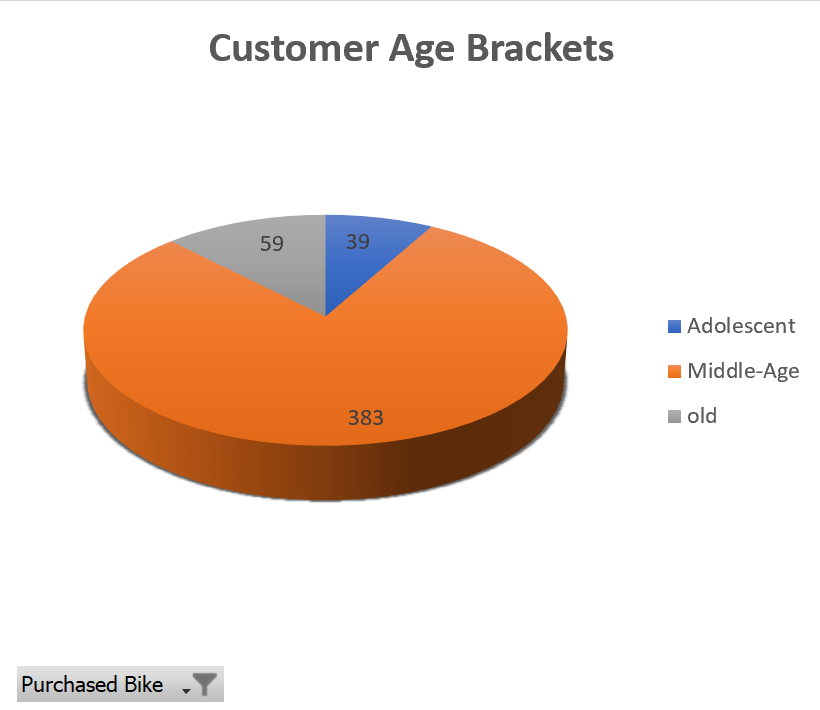
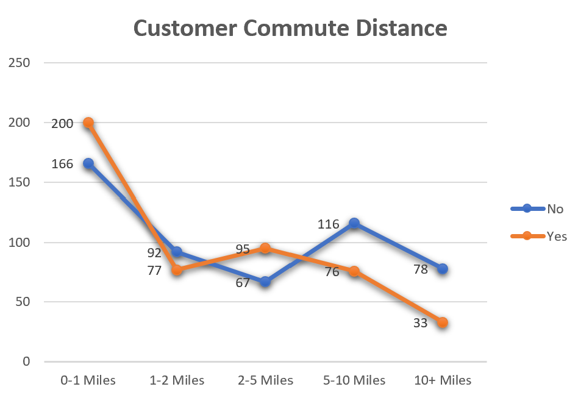
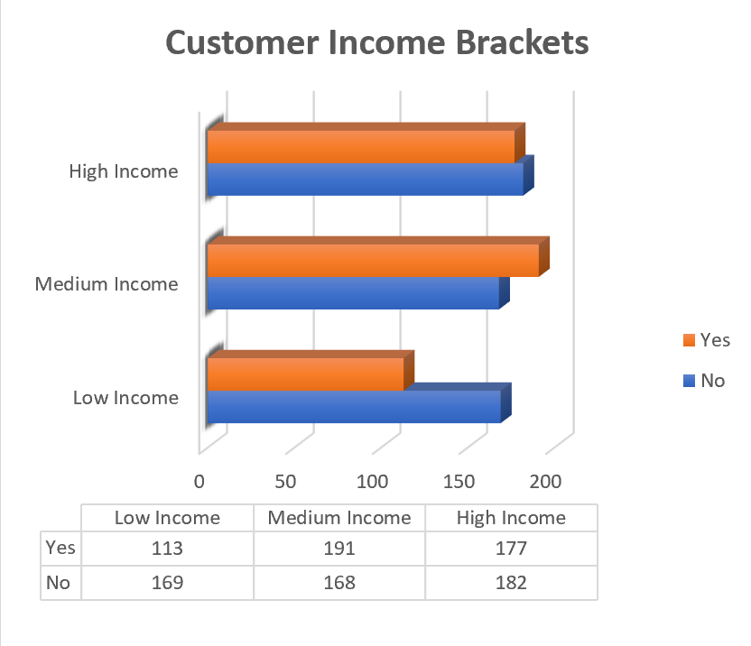
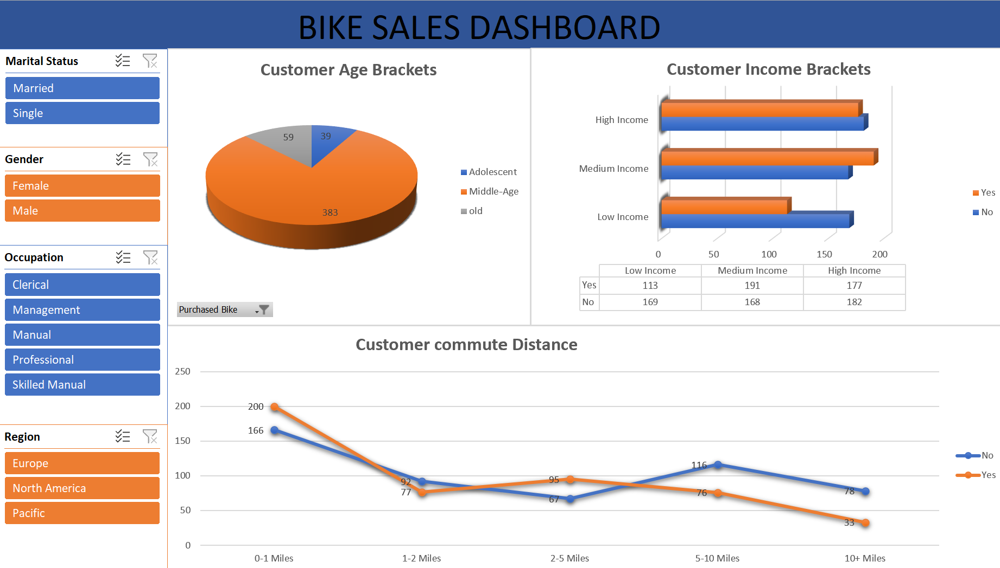

# 🚲 Bike Sales Dashboard – Excel Data Analyst Project

This project focuses on analyzing bike sales data using Microsoft Excel. I cleaned the data, performed analysis using pivot tables and charts, and built a dashboard to gain insights into customer behavior and purchasing patterns.

📌 **Project Repository:** [Excel\_Dashboard\_Bike\_Sales\_Project](https://github.com/SOWMYA0408/Excel_Dashboard_Bike_Sales_Project)

---

## 📚 Background

The dataset used in this project is an open-source dataset from [AlexTheAnalyst](/Input_Raw%20Data/Bike_Sales_Project.xlsx). Inspired by this dataset, I created an interactive dashboard to explore patterns in bike purchases.

---

## ❓ Key Questions Answered

1. Which age group purchased the most bikes?
2. Which area or distance group had the highest number of bike purchases?
3. Which income group purchased bikes the most?
4. How many females purchased bikes?
5. How many males purchased bikes?
6. Which region had the most bike sales?

> The last three questions are answered using slicers in the dashboard.

---

## 🛠 Tools & Skills Used

* **Microsoft Excel** – Used for data cleaning, pivot tables, charts, and dashboard creation.
* **Visual Studio Code** – Used to push the project to GitHub.
* **GitHub** – To showcase and share the project publicly.

---

## 📊 Analysis

### 1️⃣ Age Group vs Bike Purchase

| Age Group  | Did Not Purchase | Purchased | Total Customers |
| ---------- | ---------------- | --------: | --------------: |
| Adolescent | 71               |        39 |             110 |
| Middle-Age | 318              |       383 |             701 |
| Old        | 130              |        59 |             189 |
| **Total**  | **519**          |   **481** |        **1000** |

📉 Pivot Chart:

➡️ *Middle-aged customers purchased the most bikes.*

---

### 2️⃣ Commute Distance vs Bike Purchase

| Commute Distance | Did Not Purchase | Purchased | Total Customers |
| ---------------- | ---------------- | --------: | --------------: |
| 0–1 Miles        | 166              |       200 |             366 |
| 1–2 Miles        | 92               |        77 |             169 |
| 2–5 Miles        | 67               |        95 |             162 |
| 5–10 Miles       | 116              |        76 |             192 |
| 10+ Miles        | 78               |        33 |             111 |
| **Total**        | **519**          |   **481** |        **1000** |

📉 Pivot Chart:

➡️ *Customers living within 0–1 miles from the company purchased the most bikes.*

---

### 3️⃣ Income Level vs Bike Purchase

| Income Bracket | Did Not Purchase | Purchased | Total Customers |
| -------------- | ---------------- | --------: | --------------: |
| Low Income     | 169              |       113 |             282 |
| Medium Income  | 168              |       191 |             359 |
| High Income    | 182              |       177 |             359 |
| **Total**      | **519**          |   **481** |        **1000** |

📉 Pivot Chart:

➡️ *Medium-income customers (earning around or above \$70,000) purchased the most bikes.*

---

### 4️⃣-6️⃣ Gender & Region Insights

These insights are answered through slicers in the Excel dashboard.

📊 Dashboard Snapshot:

---

## ✅ Conclusion

This project gave me practical experience in Excel-based data analysis and dashboard creation. I learned:

* Data cleaning (removing duplicates, missing values)
* Formatting (e.g., converting currency and text values)
* Creating custom brackets for income and age groups
* Using pivot tables, charts, and slicers for dynamic dashboards

Overall, this project built my confidence in handling real-world data and designing insightful dashboards using Excel.

